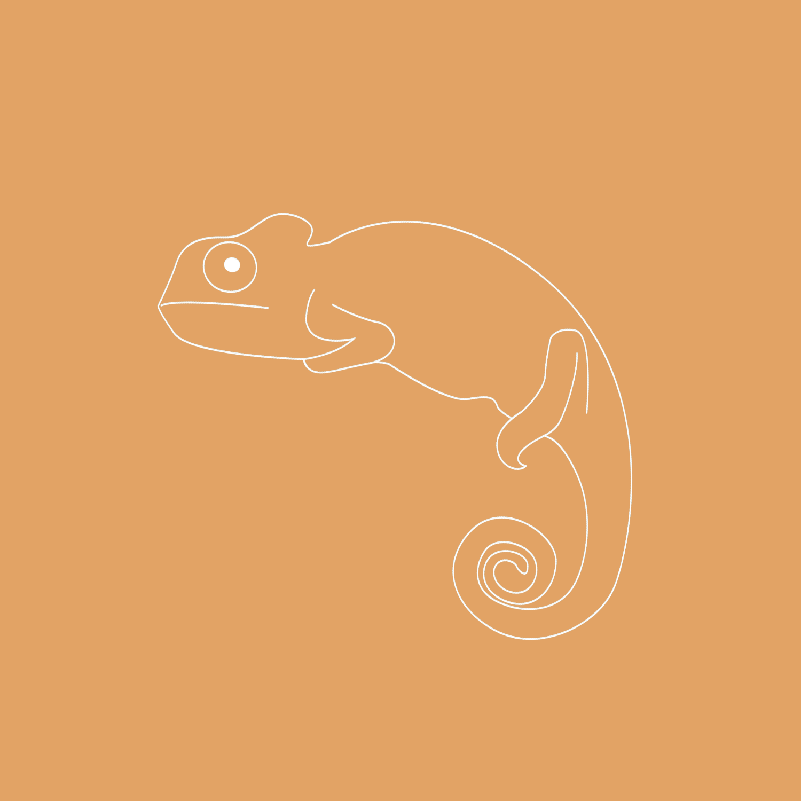
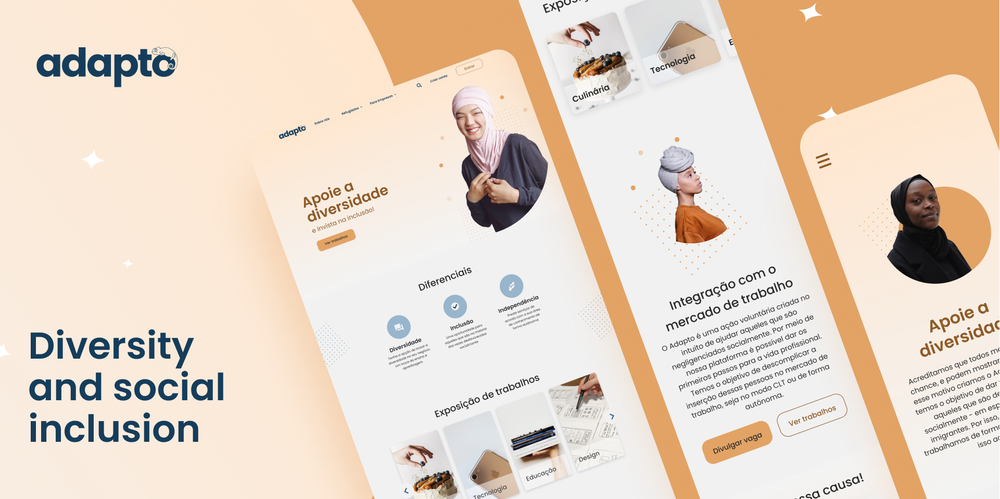

<h1 align="center">
    
</h1>

<h4 align="center">
  ADAPTO ANDROID
</h4>
<p align="center">
  
  
</p>


<p align="center">
  &nbsp;&nbsp;
  
</p>

<p align="center">
  <a href="#layout">Layout</a>&nbsp;&nbsp;&nbsp;|&nbsp;&nbsp;&nbsp;
  <a href="#projeto">Projeto</a>&nbsp;&nbsp;&nbsp;|&nbsp;&nbsp;&nbsp;
  <a href="#tecnologias">Tecnologias</a>&nbsp;&nbsp;&nbsp;|&nbsp;&nbsp;&nbsp;
  <a href="#build-e-instalação-do-app">Build e instalação do app</a>
</p>

<p align="center">
  
</p>

<br />

## Layout

O style guide e a aplicação foram prototipados no [Figma](https://www.figma.com/) e podem ser acessados clicando [aqui](https://www.figma.com/file/gBCD3BPviqp5Y17bFg3U0E/Adapto?node-id=20%3A418).

## Projeto

Adapto e Incluso é uma iniciativa que visa inserir refugiados no mercado de trabalho. Isso seria através do contato entre refugiados e as empresas, dessa forma, permite o primeiro grupo divulgue seu portfólio, trabalhos e experiências; e o segundo grupo divulgue a empresa e as vagas que estão em aberto, visando conectar diretamente com os refugiados cadastrados na plataforma.

O site está no ar e pode ser acessado clicando [aqui](https://adapto-web.netlify.app/).

_Nota: O deploy foi feito de forma gratuita no Netlify. Por isso, pode ser que sejam encontrados alguns problemas ao longo do uso da aplicação, principalmente com relação aos processos de autenticação do usuário. Dessa forma, aconselho que, para a melhor experiência no site, o projeto seja executado localmente, através do guia da sessão de setup do [ambiente de desenvolvimento](#iniciando-o-ambiente-de-desenvolvimento)._

## Tecnologias

Ambiente de desenvolvimento:
- [Android Studio](https://developer.android.com/studio)

Dependências:
- [Retrofit](https://square.github.io/retrofit/) e [okHttp](https://square.github.io/okhttp/) para comunicação com o back-end
- [Hilt](https://developer.android.com/training/dependency-injection/hilt-android?hl=pt-br) para a injeção de dependências
- [Material Design](https://material.io/develop/android) para a construção de layouts
- [Glide](https://bumptech.github.io/glide/) para a renderização de imagens
- [Coroutines](https://kotlinlang.org/docs/coroutines-overview.html) para a criação e gerenciamento de threads de processamento

## Build e instalação do app

Download do repositório:
```bash
git clone https://github.com/Ioasys-Camp-2021/adapto-android.git
cd adapto-web
```

- Abra o Android Studio, e procure pelo diretório do projeto.
- Espere o build inicial finalizar
- Conecte o seu aparelho android no computador pelo USB, e ative a ```Depuração USB``` nas opções do desenvolvedor
- Aguarde para que o Android Studio reconheça seu aparelho e ele seja exibido no campo "Target device", na barra de ferramentas superior
-  Clique em "Run"
